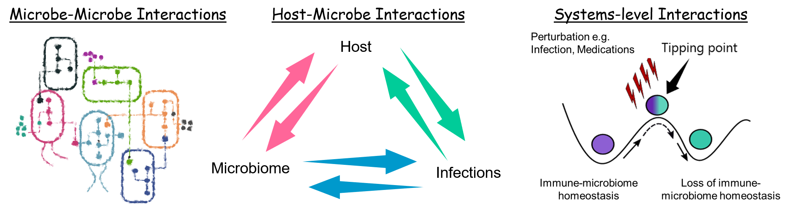
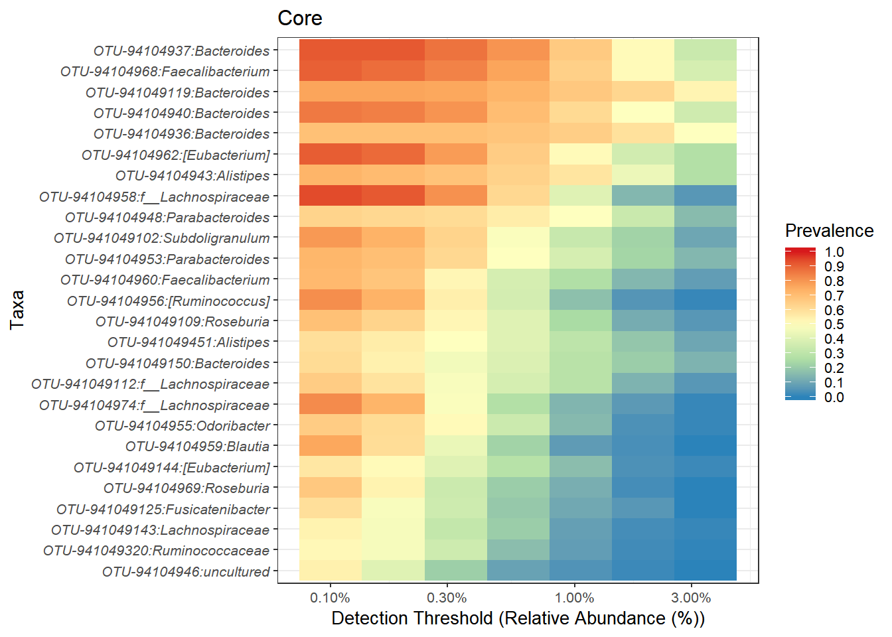
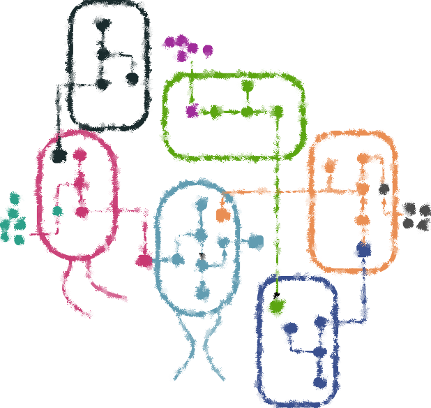
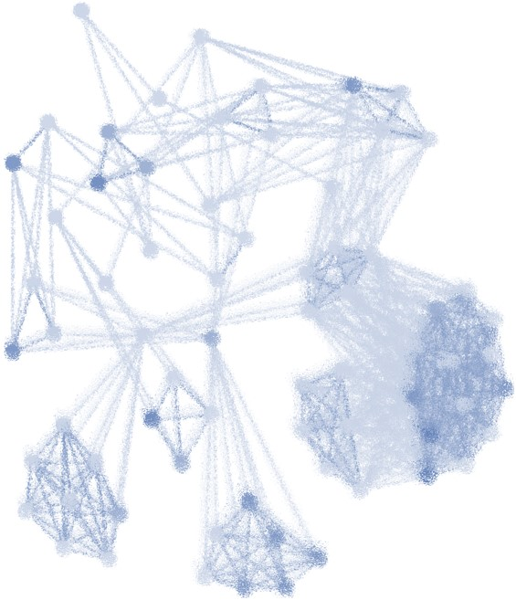

<style>
.column-left{
  float: left;
  width: 50%;
  text-align: left;
}

.column-right{
  float: right;
  width: 50%;
  text-align: left;
}

</style>


<div class="column-center">
```{r out.width='60%',fig.align='center',echo=FALSE}

```
</div> 
**Research interests**      
Host-microbe interactions, Microbe-microbe interactions, Integrated multi-omics data analysis, Synthetic microbial communities, Reproducible and open research data and tools.

---------   

> Current research     

<div class="column-left">
```{r out.width='80%',fig.align='center',echo=FALSE}

```
</div>    
**Elderly microbiota and respiratory diseases**   
Investigation of elderly microbiota presents unique challenges with respect to identifying biomarkers of health and disease. The stability of microbiota may decrease with increasing age. One key question is to understanding 'normal' microbiota of elderly compared to those with respiratory infections. In the project, we will investigate the microbiota of elderly subjects from the Netherlands part of the Ili Cohort. For details of the cohort check this article by [Van Beek J, Veenhoven RH, Bruin JP, Van Boxtel RA, De Lange MM, Meijer A, Sanders EA, Rots NY, Luytjes W. Influenza-like illness incidence is not reduced by influenza vaccination in a cohort of older adults, despite effectively reducing laboratory-confirmed influenza virus infections. The Journal of infectious diseases. 2017 Aug 15;216(4):415-24.](https://academic.oup.com/jid/article/216/4/415/3958807).    


<div class="column-left">  
</div> 
**Vaccines and InfecTious diseases in the Ageing popuLation (VITAL)**   
This is a multidisciplinary research with numerous academic and industrial partners. The consortium academic leader is Dr. Debbie van Baarle, professor of Immunology of Vaccinations at UMC Utrecht and Head of the Department of Immune Mechanisms at the Centre for Immunology of Infectious Diseases and Vaccines at RIVM National Institute for Public Health and the Environment. For more information on the project [click here](https://www.rivm.nl/node/138561).    


---------  

> On-going Collaborations   

<div class="column-left">
```{r out.width='50%',fig.align='center',echo=FALSE}

```
</div>   

**Ecophysiology of Core Human Intestinal Bacteria**  
In this project, we aim to understand the physiology and role of the core bacteria that have been identified by us. We use basic anaerobic microbiology techniques supported by genomics, proteomics and may be also transcriptomics. The goal here is to better understand these microbes before they can be used to next generation of therapeutic. For more details please click on the [link](https://academic.oup.com/femsre/article-lookup/doi/10.1093/femsre/fuw045) to check the publication for a list of interesting core bacteria in human gut.    
**Laboratory of Microbiology, Wageningen University and Research**     


<div class="column-left">
```{r out.width='40%',fig.align='center',echo=FALSE}

```
</div>  

**Towards minimal microbiome**  
In this study, we aim to study ecological and physiological dynamics of key bacterial strains in defined microbial communities. We also aim to address challenges in data acquisition, integration and visualization in such studies. The combination of multi-omics and basic anaerobic physiology is expected to give crucial insights into the resilience, stability and functional networks under well defined growth condtions.   
For more details please check our review [Reconstructing functional networks in the human intestinal tract using synthetic microbiomes](https://www.sciencedirect.com/science/article/pii/S0958166918302301).   

**Laboratory of Microbiology, Wageningen University and Research**        

---------   

> Other projects     

<div class="column-left">
```{r out.width='40%',fig.align='center',echo=FALSE}

```
</div>

* **Metagenomics study investigating links between dietary habits-gut microbiota-resistome**     
* **Metagenomics guided investigation of the impact of bacteroiphage on faecal microbiota *in-vitro* **    
* **Development of tools for microbiota analysis (see Software section)**     

<div class="column-left"> 


---------  
<div class="column-left">  
</div> 

<p>Copyright &copy; 2021 Sudarshan Shetty. All rights reserved.</p>