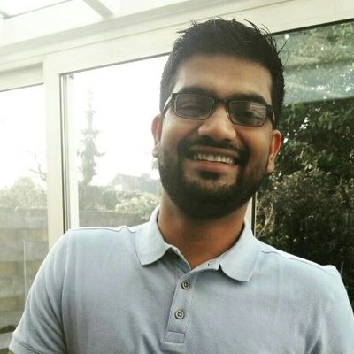

-------------------

My research interests is in understanding the role of human microbiome in health and harness its potential for developing microbiome based diagnostics and therapeutics. Microbiome research is increasingly becoming a data driven field and I combine my academic training in microbiology with my skills in microbiome data science to   

* Understand the role of human microbiome in health and disease  
* Develop open source tools to facilitate microbiome data analytics  

During my Ph.D. and Post-Doc stint at the Laboratory of Microbiology, Wageningen University and Research, I combined anaerobic microbiology with multiple -omics approaches to investigate the interactions between gut microbes using synthetic minimal microbiomes.     
Currently, I am a Post-Doc at the Dept. of Medical Microbiology and Infection Prevention, University Medical Centre Groningen (UMCG) and a guest researcher at the Netherlands National Institute for Public Health and the Environment (RIVM). My research is aimed at identifying microbial and immune biomarkers of viral infection and vaccine responsiveness. I also contribute with my expertise in microbiome data analytics on several projects using animal models of respiratory viral infections to understand the role of microbiome.  

Apart from research, I enjoy academic mentoring and teaching, creating acrylic paintings and consider my self an amateur chef. 

---------  

  

 

**Education**  

* August 2014- March 2019	  
PhD candidate at Laboratory of Microbiology, Wageningen University and Research.  
*“Ecophysiological insights into the human intestinal microbiota: from single strains to defined consortia”*  
Supervisors: Prof. dr. Willem M De Vos and Prof. dr. Hauke Smidt    
Co-Supervisor: Dr. Leo Lahti, University of Turku, Finalnd.  

* June 2009- May 2011	 
M.Sc. in Microbiology, University of Pune.  
Dissertation at National Centre for Cell Science, Pune, India.  
*“Age Related Changes in Human Gut Flora- An Indian Familial Study”*  
Advisor: Dr. Nachiket P. Marathe and Dr. Yogesh S Shouche  

---------   

   

> Research Experience  

* February 2021 - Present   
Post Doctoral Researcher at Medische microbiologie en infectiepreventie, Groningen and The Netherlands National Institute for Public Health and the Environment (Rijksinstituut voor Volksgezondheid en Milieu).   

* February 2020 - Jan 2021  
Post Doctoral Researcher at University Medical Center, Utrecht and Netherlands National Institute for Public Health and the Environment (Rijksinstituut voor Volksgezondheid en Milieu).   
•	Immune response in elderly subjects receiving vaccine(s). Investigation of various immune parameters and microbiota.      

* March 2019 - Jan 2020  
Post Doctoral Researcher at Laboratory of Microbiology, Wageningen University and Research.  
•	Design and development of synthetic human gut microbiomes.  
•	Developing multi-omics integrative biodiscovery pipelines for efficient utilization of synthetic microbiomes in a variety of biotech applications.  

* August 2014 - March 2019  	  
PhD, Laboratory of Microbiology, Wageningen University and Research.  
•	Used a combination of genomics, proteomics and anaerobic culturing to elucidate the physiology of core human intestinal bacteria.  
•	Used a combination of in-silico and in-vitro approach to develop a defined consortium of human intestinal microbiome.  
•	Developed analytical pipelines in R for high-throughput sequencing data (primarily 16S rRNA gene amplicon).    

* June 2012 - June 2014	 	
Junior Research Fellow, National Centre for Cell Science.  
•	Developed 48-well plate screening method for bio-molecules from bacteria isolated from various ecological niches of Western Ghats.  
•	Genome sequencing and analysis of potential novel anaerobic bacteria isolated from feces of healthy human subjects.  
•	High-throughput sequencing and data analysis of microbial community in human subjects with different dietary habits (The Pune Microbiome Study).  
   
   
---------  

  

 

Copyright &copy; 2021 Sudarshan Shetty. All rights reserved.

